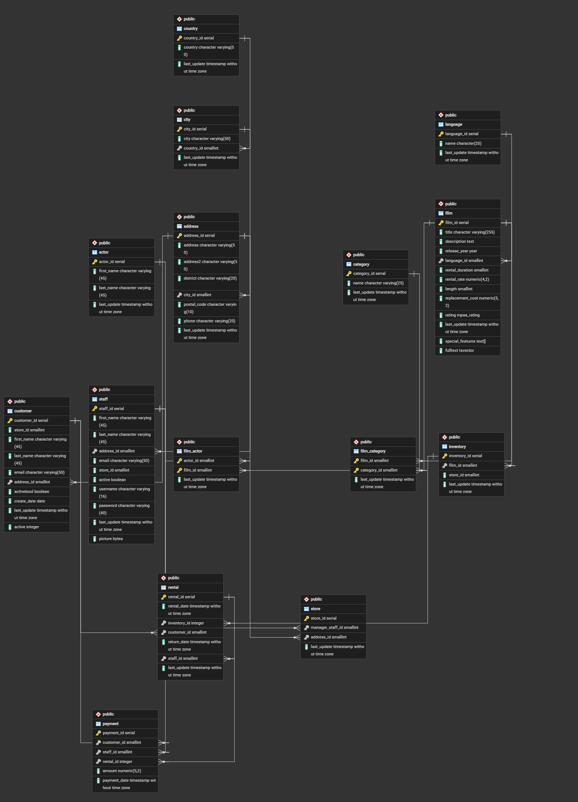

# SQL Joins & Relational Database Analysis

## Overview

Brief explanation of the DVD Rental database and the goal of learning SQL JOINs.

## Dataset

DVD Rental Sample Database
**Source**: https://neon.com/postgresql/getting-started/sample-database

# **Part 1: Relationship Discovery**

## Primary Keys and Foreign Keys

| Table             | Primary Key(s)                                       | Foreign Key(s)                                                                                                       |
| ----------------- | ---------------------------------------------------- | -------------------------------------------------------------------------------------------------------------------- |
| **actor**         | `actor_id`                                           | —                                                                                                                    |
| **address**       | `address_id`                                         | `city_id` → `city.city_id`                                                                                           |
| **category**      | `category_id`                                        | —                                                                                                                    |
| **city**          | `city_id`                                            | `country_id` → `country.country_id`                                                                                  |
| **country**       | `country_id`                                         | —                                                                                                                    |
| **customer**      | `customer_id`                                        | `address_id` → `address.address_id`                                                                                  |
| **film**          | `film_id`                                            | `language_id` → `language.language_id`                                                                               |
| **film_actor**    | (`actor_id`, `film_id`) *(Composite Primary Key)*    | `actor_id` → `actor.actor_id` `film_id` → `film.film_id`                                                          |
| **film_category** | (`film_id`, `category_id`) *(Composite Primary Key)* | `film_id` → `film.film_id` `category_id` → `category.category_id`                                                 |
| **inventory**     | `inventory_id`                                       | `film_id` → `film.film_id`                                                                                           |
| **language**      | `language_id`                                        | —                                                                                                                    |
| **payment**       | `payment_id`                                         | `customer_id` → `customer.customer_id` `rental_id` → `rental.rental_id` `staff_id` → `staff.staff_id`          |
| **rental**        | `rental_id`                                          | `customer_id` → `customer.customer_id` `inventory_id` → `inventory.inventory_id` `staff_id` → `staff.staff_id` |
| **staff**         | `staff_id`                                           | `address_id` → `address.address_id`                                                                                  |
| **store**         | `store_id`                                           | `address_id` → `address.address_id` `manager_staff_id` → `staff.staff_id`                                         |

## Relationship Diagram

The Entity Relationship Diagram (ERD) was generated using pgAdmin's Generate ERD feature. The diagram illustrates the relationships between the normalized tables through their primary and foreign keys.

> Right click on the db --> select ERD for databse --> generate ERD and download it

#### ER Diagram:

---

# **Part 2: SQL JOIN Challenges**

## JOIN Types

**JOIN/INNER JOIN**:Used when matching rows exist in both tables.

**LEFT JOIN**: Returns all rows from the left table and matching rows from the right table.

**RIGHT JOIN**: Returns all rows from the right table and matching rows from the left table.

**FULL OUTER JOIN**: Returns all rows from both tables, matching where possible.

---

## SQL Queries

All 10 required queries plus the bonus challenge are in `joins.sql`

### 1. Display Customer Name, Email, City, and Country.

**Explanation:** customer → address → city → country, all JOIN since every customer has a valid address chain.

### 2. Display every payment with Customer Name, Film Title, and Amount Paid.

**Explanation:** payment → customer, and payment → rental → inventory → film to reach the film title, since payment only stores rental_id, not film_id directly.

### 3. Same as above

### 4. Find the Top 10 customers based on total amount spent.

**Explanation:** customer INNER JOIN payment, SUM(amount) grouped by customer, sorted descending, LIMIT 10 (to display top 10 customers)

### 5. Display each film with its Category and Rental Rate.

**Explanation:** film → film_category → category (bridge table needed because film-category is many-to-many in schema, though 1:1 in this dataset).

### 6. Find all actors who appeared in each film.

**Explanation:** film → film_actor → actor. The film_actor bridge table connects films and actors. INNER JOIN was used to list every actor who appeared in each film

### 7. Count how many films belong to each category.

**Explanation:** category → film_category. The film_category table links films to categories through INNER JOIN. Grouping the joined records by category makes it possible to count how many films belong to each category

### 8. Which categories generated the highest revenue? (Hint: This requires joining multiple tables.)

**Explanation:** category → film_category → film → inventory → rental → payment. Revenue is not stored in the category table, so multiple INNER JOINs were required to trace each category through its films, rentals, and payments. The payment amounts were then summed to calculate the total revenue generated by each category.

### 9. Find customers who have rented more than 20 films.

**Explanation:** customer → rental. Each rental belongs to a customer. INNER JOIN was used to count the total rentals for every customer and filter those with more than 20 films.

### 10. Which cities generated the highest rental revenue?

**Explanation:** payment → customer → address → city. Payments were linked to customers, whose addresses identify their cities. Grouping the payment amounts by city made it possible to calculate the total rental revenue generated by each city.

### **Bonus Challenge**: Which actor has generated the highest total rental revenue?

**Explanation:** actor → film_actor → film → inventory → rental → payment. There is no direct relationship between actors and payments, so multiple INNER JOINs were used to connect the related tables. The query starts with the actor table, uses the film_actor bridge table to find the films each actor appeared in, follows those films through inventory and rental, and finally reaches the payment table. The payment amounts are summed for each actor and grouped by actor to calculate the total rental revenue generated by their films. The results are then sorted in descending order to identify the actor whose films generated the highest revenue

---

# Business Insights

### 1. **Some customers spend much more than others.** 

Eleanor Hunt spent the most (**$211.55**), followed by Karl Seal and Marion Snyder. These customers are important because they bring in more revenue than the average customer.

### 2. **Sports movies made the most money.** 

The **Sports** category had the highest rental revenue (**$4,892.19**), followed by **Sci-Fi** and **Animation**. This shows that these categories are more popular with customers.

### 3. **Some cities earned more rental revenue than others.** 

**Saint-Denis** had the highest rental revenue (**$211.55**), followed by **Cape Coral** and **Santa Brbara dOeste**. This shows that customer activity is different depending on the city.

---
## Skills Demonstrated

* Relational schema analysis (PK/FK identification)
* SQL JOIN types: INNER, LEFT, RIGHT, FULL OUTER, SELF
* Using CONCAT to combine strings
* Aggregate functions with GROUP BY / HAVING
* Multi-hop join path reasoning across bridge tables
* ER diagramming
* Business-question-driven query writing

---

## Author

*Imama Zubair*

AI & Data Science Intern @ Netixsol