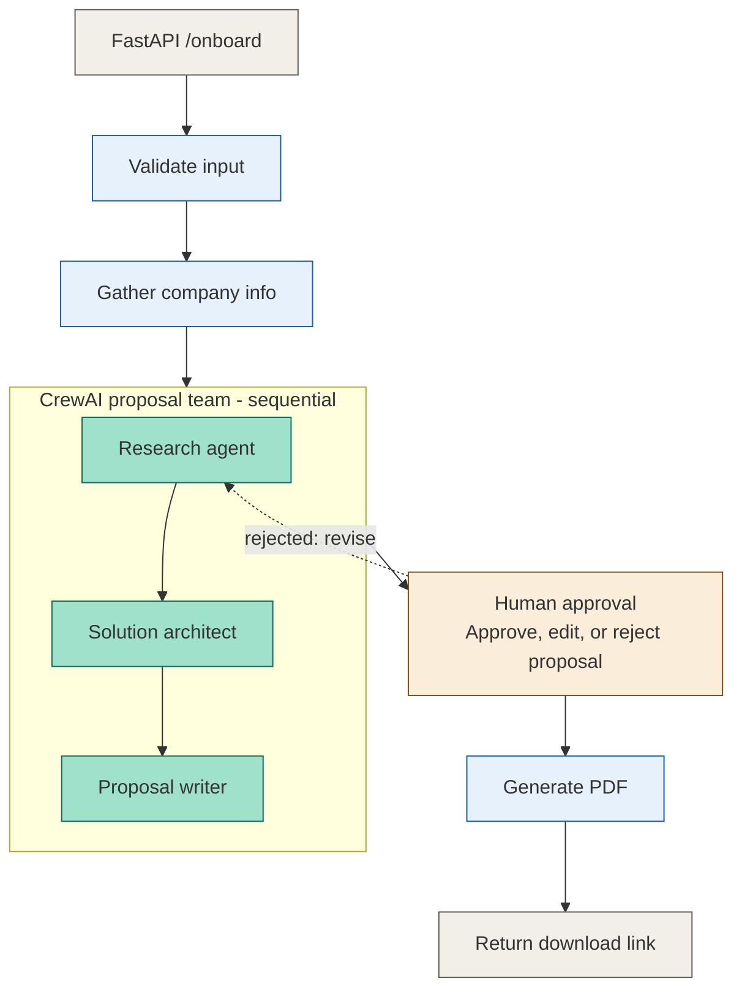

# Architecture diagram: Web3Geeks client onboarding agent

```mermaid
flowchart TD
    A[FastAPI /onboard] --> B[Validate input]
    B --> C[Gather company info]
    C --> D

    subgraph D[CrewAI proposal team - sequential]
        D1[Research agent] --> D2[Solution architect] --> D3[Proposal writer]
    end

    D --> E[Human approval<br/>Approve, edit, or reject proposal]
    E --> F[Generate PDF]
    F --> G[Return download link]

    E -.->|rejected: revise| D1

    style A fill:#F1EFE8,stroke:#5F5E5A
    style B fill:#E6F1FB,stroke:#185FA5
    style C fill:#E6F1FB,stroke:#185FA5
    style D1 fill:#9FE1CB,stroke:#0F6E56
    style D2 fill:#9FE1CB,stroke:#0F6E56
    style D3 fill:#9FE1CB,stroke:#0F6E56
    style E fill:#FAEEDA,stroke:#854F0B
    style F fill:#E6F1FB,stroke:#185FA5
    style G fill:#F1EFE8,stroke:#5F5E5A
```
