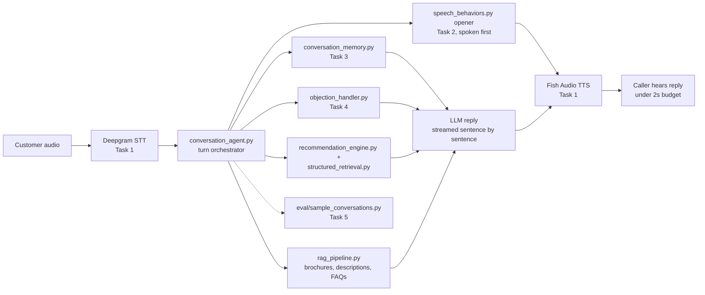

# Week 7 - Day 3: Voice Agent & Natural Conversation

Day 3 of the capstone. Turns the Day 1/2 real estate agent into a voice
agent that sounds like a real Pakistani sales executive. The domain (real
estate) doesn't matter much here, nothing in `src/` is hardcoded to it. All
of it is driven by `config/domain_config.yaml`.

This folder is self-contained: its own `db/knowledge_base.db` (60
properties), its own `data/` and `documents/`, and its own copies of
`structured_retrieval.py`, `recommendation_engine.py`, and `rag_pipeline.py`
from Day 2. Day 1 and Day 2 aren't touched.

Everything is a real API call, not a mock: **Deepgram** for STT (Urdu), a
real streaming LLM for replies, and **Fish Audio** for voice (the free
`s2.1-pro-free` model). There's no live microphone wired in yet (see
"Live Microphone Input" below), so `sample_audio/` has pre-recorded Urdu
customer lines instead.

---

## Workflow



---

## Folder Structure

```
Day3/
├── README.md
├── config/domain_config.yaml    # domain-agnostic config: fields, weights, RAG settings
├── data/                        # structured CSVs (properties, locations, amenities, ...)
├── db/                          # knowledge_base.db (SQLite) + chroma/ (vector store)
├── documents/                   # brochures/ + descriptions/, per-property text
├── prompts/system_prompt.md     # persona scope, guardrails, persuasion rules
├── persona/urdulish_persona.md  # tone + example phrases, source for speech_behaviors.py
├── sample_audio/                # pre-recorded Urdu customer lines + the script that made them
├── full_pipeline_test/          # real multi-turn test: STT + memory + streaming LLM + TTS together
├── src/
│   ├── voice_pipeline.py        # Task 1: Deepgram STT, streaming LLM, Fish Audio TTS, latency
│   ├── speech_behaviors.py      # Task 2: fillers, hesitation, interruption, laughter, ack
│   ├── conversation_memory.py   # Task 3: slot-based memory across turns
│   ├── objection_handler.py     # Task 4: objection detection + strategy
│   ├── conversation_agent.py    # ties everything into one turn loop
│   ├── structured_retrieval.py  # Day 2: exact SQL facts (price, availability, schools, hospitals, ...)
│   ├── recommendation_engine.py # Day 2: ranks properties against structured data
│   └── rag_pipeline.py          # Day 2: semantic search over brochures/descriptions/FAQs
├── eval/
│   ├── sample_conversations.py  # Task 5: runs 5 scripted calls through the real pipeline
│   └── human_eval_rubric.md     # Task 5: scores + honest gaps
└── outputs/                     # sample_transcripts.md + latency_summary.json, real runs
```

## Setup

You'll need these in `.env` at the repo root:

| Variable | For | Notes |
|---|---|---|
| `DEEPGRAM_API_KEY` | STT | only needed for audio-in paths, not the text-scripted eval |
| `BASE_URL`, `API_KEY` | LLM replies | any OpenAI-compatible chat endpoint |
| `FISH_AUDIO_API_KEY`, `FISH_VOICE_ID` | TTS | free tier, get the key from fish.audio |
| `FISH_MODEL` | TTS (optional) | defaults to `s2.1-pro-free` |
| `DEEPGRAM_LANGUAGE` | STT (optional) | defaults to `ur`, needed or nova-3 mistranscribes Urdu |

## How to Run

```bash
cd src
python3 conversation_memory.py     # Task 3: budget -> area -> "cheaper" memory chain
python3 objection_handler.py       # Task 4: objection categories
python3 speech_behaviors.py        # Task 2: fillers/hesitation/interruption
python3 voice_pipeline.py          # Task 1: real STT -> LLM -> TTS against sample_audio/
python3 voice_pipeline.py --single # Task 1: one turn, pre-written reply, TTS only
python3 conversation_agent.py      # a full 5-turn conversation

cd ../eval
python3 sample_conversations.py    # Task 5: writes outputs/sample_transcripts.md

cd ../full_pipeline_test
python3 run_full_pipeline_test.py  # real STT + memory + streaming LLM + TTS, all together
```

### Why there are three different test paths

Each one isolates a different variable, none of them alone covers everything:

| Path | STT | Memory across turns | What it proves |
|---|---|---|---|
| `voice_pipeline.py` (no args) | Real | No, each `sample_audio/` file is isolated | The Speech leg works end to end on real audio |
| `eval/sample_conversations.py` | Skipped, scripted text | Yes | Memory/objection/LLM logic is correct, without ASR noise as a confound |
| `full_pipeline_test/run_full_pipeline_test.py` | Real | Yes | The whole thing is cohesive: real audio in, memory carried, real reply, real audio out |

Both `voice_pipeline.py` and the eval script write generated audio with a
`turn_001`, `turn_002`, ... counter that restarts every run, so they don't
clobber each other's output: `generated_audio/fish_audio/offline_test/` and
`generated_audio/fish_audio/` respectively. `full_pipeline_test/` writes its
own audio into `full_pipeline_test/agent_audio/`.

---

## Task 1: Streaming Voice Pipeline

Deepgram STT, then a streaming LLM call, then Fish Audio TTS. Each sentence
is synthesized and spoken as soon as it's ready, instead of waiting for the
whole reply to finish generating.

- The LLM call streams from `generate_llm_reply_stream()` in
  `voice_pipeline.py`, called by `conversation_agent.py`'s
  `_generate_reply_stream()`.
- Before the real reply starts, the agent always speaks a filler and
  hesitation opener ("Dekhiye... Ek second sir, main abhi availability
  check kar leta hoon."). That's canned text with zero LLM latency, so it
  covers the LLM's think time while the real reply is still generating.
- Sentences get a light `[emotion]` tag before TTS (question gets
  `[curious]`, "!" gets `[excited]`), since Fish Audio reads those markers
  to shape delivery.
- `_clean_for_speech()` strips markdown, emoji, and stray formatting before
  anything reaches TTS. If a sentence still can't be synthesized, it's
  skipped and the rest of the reply keeps going rather than the whole turn
  crashing.

**Latency, text-scripted path** (STT skipped, real streaming LLM, real Fish
Audio TTS, from `outputs/latency_summary.json`):

| Scenario | Turns | Latency per turn (ms) |
|---|---|---|
| 1. Budget + area memory | 4 | 1639, 1843, 2156, 1656 |
| 2. Price objection, double decline | 4 | 1640, 1750, 1530, 1577 |
| 3. Investment guardrail | 2 | 1828, 1563 |
| 4. Trust + builder concerns | 3 | 1531, 1421, 1656 |
| 5. Interruption mid call | 2 | 1702, 1875 |

**15 turns total. Average 1691ms. Min 1421ms. Max 2156ms. 1 of 15 turns
went over the 2000ms budget** (scenario 1, turn 3).

**Latency, full audio-in path** (real Deepgram STT against the 6
`sample_audio/` files): 4.4s to 7.2s, every one over budget. Deepgram's
batch endpoint genuinely takes several seconds per real audio clip in this
environment. Getting under 2s for real audio needs Deepgram's *streaming*
endpoint (partial transcripts while the caller talks), not wired up yet.

---

## Task 2: Natural Speech Behaviors

`speech_behaviors.py` reuses the hesitation/acknowledgement phrases already
written in `urdulish_persona.md`, organized by *when* to use them:

- **Fillers** ("Hmm...", "Acha...", "Dekhiye...") before reasoning-heavy
  replies, fired sometimes, not every turn.
- **Hesitation** ("Ek second sir, main abhi availability check kar leta
  hoon") always fires while a tool call is running, since silence during a
  real delay sounds like a dropped call.
- **Acknowledgements** ("Ji bilkul samajh gaya") for light confirmations.
- **Light laughter** only in genuinely light moments, never near a
  complaint or price objection.
- **Interruptions** ("Ji sir, boliye") for barge-in. This module just
  returns what to say, `conversation_agent.py` handles stopping the audio.

The filler and hesitation phrase can both fire on the same turn ("Dekhiye...
Ek second sir...") since they're both part of the same opener now. A little
eager, but it also means the LLM's think time gets covered more reliably.
Not a bug, just a tuning call worth revisiting later.

---

## Task 3: Context Memory

`conversation_memory.py` is a slot dictionary plus recent turn history. No
vector store needed for a call that's a few minutes long.

Confirmed working on the real pipeline:

```
"Budget 3 crore hai."          -> budget = 30,000,000
"DHA mein kya options hain?"   -> area = "DHA Phase 6" (budget still remembered)
"Us se sasti koi option?"      -> lowers budget below the last-shown price
```

Slots feed straight into `recommendation_engine.recommend_properties()`
through `as_recommendation_kwargs()`, no extra glue code needed.

---

## Task 4: Objection Handling

`objection_handler.py` classifies what the customer said into one of six
categories (price, trust, location, investment, builder, maintenance) and
returns a strategy: talking points and guardrails, not a canned line. The
LLM turns that into actual UrduLish.

- Investment objections never get a guaranteed-return promise. The agent
  explicitly refuses and offers to connect with a human advisor.
- After two clear declines, the agent stops pushing and says goodbye with a
  fixed line that skips the LLM on purpose, since that moment is too
  safety-critical to leave to LLM phrasing variance.

---

## Grounding: Structured Data + RAG

Every reply is built from real data, not just the LLM's own knowledge.
`conversation_agent.py`'s `_build_prompt_context()` pulls in:

| Source | What it grounds |
|---|---|
| `structured_retrieval.py` (SQL) | Price, availability, bedrooms, agent name, nearby schools, nearby hospitals, developer reputation, area market data, payment plans |
| `rag_pipeline.py` (vector search) | Brochures, property descriptions, and FAQs, retrieved by semantic similarity to what the customer said |

The RAG side uses a Chroma collection already built in `db/chroma/` (140
chunks, local `sentence-transformers` embeddings). Retrieval is local and
fast, no extra LLM call for it. It's folded straight into the same single
prompt the reply LLM call already uses, so grounding doesn't cost a second
network round trip.

This closes a real Day 2 to Day 3 gap: `get_nearby_schools()` and
`get_nearby_hospitals()` already existed in `structured_retrieval.py` but
were never called, and `rag_pipeline.py` was built but never wired into a
live reply. Both are now part of every turn.

---

## Task 5: Human Evaluation

`eval/sample_conversations.py` runs 5 scripted calls through the real
pipeline and scores the transcripts against `eval/human_eval_rubric.md`.

| Category | Score |
|---|:-:|
| Naturalness | 4.0 / 5 |
| Persuasiveness | 4.0 / 5 |
| Fluency | 4.4 / 5 |
| Latency | 3.0 / 5 |
| Conversation Flow | 5.0 / 5 |

Scores predate the current latency numbers above (they were scored on an
earlier run, before Fish Audio and streaming). See the rubric for the full
per-scenario breakdown and honest gaps.

---

## Full Pipeline Test

`full_pipeline_test/run_full_pipeline_test.py` runs a real 3-turn
conversation ("Budget 3 crore hai" then "DHA mein kya options hain?" then
"Us se sasti koi option?", the same memory example from the spec) through
the entire stack in one continuous call: real Deepgram STT on real audio,
one shared memory object across turns, the streaming LLM reply, and real
Fish Audio TTS.

`conversation_agent.py`'s `run_turn()` expects already-transcribed text
(it updates memory from its input directly, before any STT would happen),
so this script does STT explicitly first, then hands the transcript to
`run_turn()`. Output:

- `full_pipeline_test/agent_audio/` (real synthesized replies, per sentence)
- `full_pipeline_test/pipeline_test_log.json` (transcript, reply, memory
  snapshot, and latency breakdown, per turn)

---

## Live Microphone Input

Not wired in yet, but the code exists, commented out, ready to enable:

- `voice_pipeline.py` has `record_microphone_audio()` commented out right
  after `load_audio_file()`. It records from the default input device and
  returns `(wav_bytes, "audio/wav")`, the same shape `load_audio_file()`
  already returns, so it's a drop-in replacement anywhere audio bytes are
  used.
- `conversation_agent.py` has `run_live_mic_conversation()` commented out
  right after `run_turn()`. It records, transcribes, and calls `run_turn()`
  in a loop, the same pattern `full_pipeline_test/` uses for pre-recorded
  audio.

To turn it on: `pip install sounddevice`, uncomment both blocks, call
`run_live_mic_conversation()`.

---

## Where the real APIs plug in (and what's still a stub)

| File | Real | Still a stub |
|---|---|---|
| `voice_pipeline.py` | Deepgram STT (`language=ur`), Fish Audio TTS, streaming LLM call, text sanitization | Twilio (`telephony_send_audio()` raises on purpose instead of faking success); Deepgram's streaming endpoint (batch endpoint used instead); live mic capture (commented out, see above) |
| `conversation_agent.py` | Streaming LLM call grounded in memory, objection strategy, structured retrieval, and RAG | not yet feeding developer/school/hospital data into every objection type explicitly, just always available in context |

Edge TTS's implementation is still in `voice_pipeline.py`, commented out,
in case Fish Audio's free tier ever goes away.

## Next Steps

Roughly in order of what actually moves the needle:

1. Switch Deepgram to its streaming endpoint instead of the batch one, now
   the biggest latency gap since the LLM side already streams.
2. Wire up Twilio for real phone audio, and enable the live mic scaffold
   above for local testing in the meantime.
3. Re-run `eval/human_eval_rubric.md`'s scoring pass against the current
   pipeline (Fish Audio, streaming, grounding), since the existing scores
   predate all three.
