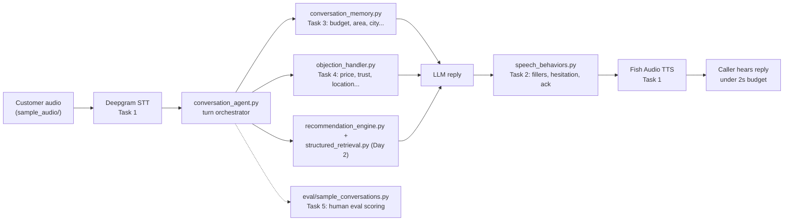

# Week 7 - Day 3: Voice Agent & Natural Conversation

This is Day 3 of the capstone: turning the Day 1/2 real estate agent into a
voice agent that sounds like a real Pakistani sales executive. The domain
(real estate) doesn't matter much here — nothing in `src/` is hardcoded to
it, it's all driven by `config/domain_config.yaml`.

This folder is self-contained: its own `db/knowledge_base.db` (60
properties), its own `data/` and `documents/`, and its own copies of
`structured_retrieval.py` / `recommendation_engine.py` / `rag_pipeline.py`
from Day 2, so it runs standalone. Day 1 and Day 2 aren't touched.

Everything here is a real API call, not a mock: **Deepgram** for STT (Urdu),
a real LLM for replies, and **Fish Audio** for voice (the free `s2.1-pro-free`
model, no paid tier needed). Edge TTS was used for a while when Fish Audio
was paid-only, but that's fine now. There's no live microphone
in this environment, so `sample_audio/` has some pre-recorded Urdu customer
lines instead.

---

## Workflow



---

## Folder Structure

```
Day3/
├── README.md
├── config/domain_config.yaml    # domain-agnostic config: fields, weights, RAG settings
├── data/                        # structured CSVs (properties, locations, amenities, ...)
├── db/                          # knowledge_base.db (SQLite) + chroma/ (vector store)
├── documents/                   # brochures/ + descriptions/, per-property text
├── prompts/system_prompt.md     # persona scope, guardrails, persuasion rules
├── persona/urdulish_persona.md  # tone + example phrases, source for speech_behaviors.py
├── sample_audio/                # pre-recorded Urdu customer lines + the script that made them
├── src/
│   ├── voice_pipeline.py        # Task 1: Deepgram -> LLM -> Fish Audio TTS, latency, TTS-safety cleanup
│   ├── speech_behaviors.py      # Task 2: fillers, hesitation, interruption, laughter, ack
│   ├── conversation_memory.py   # Task 3: slot-based memory across turns
│   ├── objection_handler.py     # Task 4: objection detection + strategy
│   ├── conversation_agent.py    # ties everything into one turn loop
│   ├── structured_retrieval.py  # Day 2: exact SQL facts (price, availability, ...)
│   ├── recommendation_engine.py # Day 2: ranks properties against structured data
│   └── rag_pipeline.py          # Day 2: brochure/FAQ semantic search — not wired in yet, see gaps
├── eval/
│   ├── sample_conversations.py  # Task 5: runs 5 scripted calls through the real pipeline
│   └── human_eval_rubric.md     # Task 5: scores + honest gaps
└── outputs/                     # sample_transcripts.md + latency_summary.json, real runs
```

## Setup

You'll need these in `.env` at the repo root:

| Variable | For | Notes |
|---|---|---|
| `DEEPGRAM_API_KEY` | STT | only needed for audio-in paths, not the text-scripted eval |
| `BASE_URL`, `API_KEY` | LLM replies | any OpenAI-compatible chat endpoint |
| `FISH_AUDIO_API_KEY`, `FISH_VOICE_ID` | TTS | free tier, get the key from fish.audio |
| `FISH_MODEL` | TTS (optional) | defaults to `s2.1-pro-free` |
| `DEEPGRAM_LANGUAGE` | STT (optional) | defaults to `ur` — nova-3 mistranscribes Urdu without this


## How to Run

```bash
cd src
python3 conversation_memory.py     # Task 3: budget -> area -> "cheaper" memory chain
python3 objection_handler.py       # Task 4: objection categories
python3 speech_behaviors.py        # Task 2: fillers/hesitation/interruption
python3 voice_pipeline.py          # Task 1: real STT -> LLM -> TTS against sample_audio/
python3 voice_pipeline.py --single # Task 1: one turn, pre-written reply, TTS only
python3 conversation_agent.py      # a full 5-turn conversation

cd ../eval
python3 sample_conversations.py    # Task 5: writes outputs/sample_transcripts.md
```

### Why sample_audio and the eval script aren't the same thing

`sample_audio/`'s 6 files get used by `voice_pipeline.py`'s own test
(`python3 voice_pipeline.py`, no args) — each file goes through real
Deepgram STT, then the LLM, then real TTS. That's the actual proof that the
Speech leg works, since Deepgram is genuinely transcribing Urdu audio here.
Each file is a single isolated turn, no memory carried between them.

`eval/sample_conversations.py` (Task 5) instead scripts 5 multi-turn
conversations as plain **text** (memory chains, objections, an
interruption) and feeds that straight to the agent, skipping STT. This is
on purpose: it lets memory/objection logic get tested exactly, without
Deepgram's transcription accuracy on code-switched Urdu-English muddying
whether a bad reply was the agent's fault or the ASR's.

One more thing worth knowing: both paths save generated audio with a
`turn_001`, `turn_002`, ... counter that restarts every run, so running
`voice_pipeline.py` standalone won't clobber the eval script's audio —
they write to `generated_audio/fish_audio/offline_test/` and
`generated_audio/fish_audio/` respectively. (Old Edge TTS output from before
the switch is still sitting directly in `generated_audio/`, kept separate on
purpose so the two don't mix.)

---

## Task 1: Streaming Voice Pipeline

`voice_pipeline.py` does Deepgram (STT) -> LLM -> Fish Audio TTS -> (Twilio,
not wired yet). The reply gets split into sentences and each one is
synthesized separately, so the first sentence starts playing while the rest
are still being generated. Sentences also get a light `[emotion]` tag
(question -> `[curious]`, "!" -> `[excited]`, etc.) before TTS, since Fish
Audio reads those markers to shape delivery — small thing, but it stops
replies sounding flat.

**What actually gets measured as "latency to first audio":** STT + TTS's
first chunk + telephony (currently 0, no Twilio yet). It does **not**
include how long the LLM takes to think — more on why that matters below.

Real numbers, text-scripted path (STT skipped, 15 turns, from
`outputs/latency_summary.json`): **avg 1069ms, min 766ms, max 1906ms, 0/15
over the 2000ms budget.**

Real numbers, full audio-in path (actual Deepgram STT + TTS against
the 6 `sample_audio/` files): **4.4s-7.2s, every one over budget.** The
original "150-300ms for STT" assumption in an earlier draft of this doc was
never actually tested — turns out Deepgram's batch/prerecorded endpoint
genuinely takes several seconds for a real audio clip in this environment.
Getting under 2s for real audio needs Deepgram's *streaming* endpoint
(partial transcripts while the caller talks), which isn't wired up yet.
(These numbers are from the Edge TTS days — haven't re-run the full
audio-in suite since switching to Fish Audio, but the STT side of the
bottleneck doesn't change either way.)

**The bigger honest gap:** the LLM call in `conversation_agent.py` is
blocking — it waits for the whole reply before anything gets spoken.
There's already a working streaming version (`generate_llm_reply_stream()`
in `voice_pipeline.py`) that would let TTS start on the first sentence
while the LLM keeps generating, but it isn't hooked up to the live call
path yet. So "latency to first audio" as currently measured is skipping
one of the biggest real delays a caller would feel. This is the single
biggest thing to fix to make "under 2 seconds" true end to end.

**Making sure text is actually speakable:** real LLM output isn't always
clean. A bare "2." at the start of a line reads as "two dot" out loud and
also confuses the sentence splitter into treating it as its own fragment;
emoji caused problems with Edge TTS specifically (it returned literally no
audio for an emoji-only sentence). `_clean_for_speech()` strips both before
anything reaches TTS. If a sentence still can't be synthesized (bad request,
empty response, network hiccup), that one sentence gets skipped and the rest
of the reply keeps going rather than the whole turn crashing.

---

## Task 2: Natural Speech Behaviors

`speech_behaviors.py` reuses the hesitation/acknowledgement phrases already
written in `urdulish_persona.md`, just organized by *when* to use them:

- **Fillers** ("Hmm...", "Acha...", "Dekhiye...") before reasoning-heavy
  replies, fired sometimes, not every turn.
- **Hesitation** ("Ek second sir, main abhi availability check kar leta
  hoon") always fires while a tool call is running, since silence during a
  real delay sounds like a dropped call.
- **Acknowledgements** ("Ji bilkul samajh gaya") for light confirmations.
- **Light laughter** only in genuinely light moments, never near a
  complaint or price objection.
- **Interruptions** ("Ji sir, boliye") for barge-in — this module just
  returns what to say, `conversation_agent.py` handles stopping the audio.

One thing worth flagging: the filler and the hesitation phrase are both
gated on the same "a tool call is happening" flag, so they can both fire on
the same turn — you'll see things like "Dekhiye... Zara rukiye, main
confirm kar ke batata hoon." in the real transcripts, which is two
throat-clearing phrases back to back. A real agent would just pick one.
Not fixed here since it's a tuning call, not a bug, but worth a look later.

---

## Task 3: Context Memory

`conversation_memory.py` is just a slot dictionary plus recent turn
history — no vector store needed for a call that's a few minutes long.

Confirmed working on the real pipeline (`outputs/sample_transcripts.md`,
scenario 1):

```
"Budget 3 crore hai."          -> budget = 30,000,000
"DHA mein kya options hain?"   -> area = "DHA Phase 6" (budget still remembered)
"Us se sasti koi option?"      -> lowers budget below the last-shown price
```

Slots feed straight into `recommendation_engine.recommend_properties()`
through `as_recommendation_kwargs()`, no extra glue code needed.

---

## Task 4: Objection Handling

`objection_handler.py` classifies what the customer said into one of six
categories (price, trust, location, investment, builder, maintenance) and
returns a strategy — talking points and guardrails, not a canned line. The
LLM turns that into actual UrduLish. Confirmed in the real transcripts:

- Investment objections never get a guaranteed-return promise — the agent
  explicitly refuses and offers to connect with a human advisor.
- After two clear declines, the agent stops pushing and says goodbye with
  a fixed line that skips the LLM on purpose — too safety-critical to leave
  to LLM phrasing variance.

---

## Task 5: Human Evaluation

`eval/sample_conversations.py` runs 5 scripted calls through the real
pipeline and scores the transcripts against `eval/human_eval_rubric.md`.

| Category | Score |
|---|:-:|
| Naturalness | 4.0 / 5 |
| Persuasiveness | 4.0 / 5 |
| Fluency | 4.4 / 5 |
| Latency | 3.0 / 5 |
| Conversation Flow | 5.0 / 5 |

Latency isn't scored 5/5 even though 0/15 scripted turns went over budget —
that number skips real STT (which is itself over budget, 4.4-7.2s) and LLM
time, so it understates what a caller would actually wait through. See the
rubric for the full per-scenario breakdown.

---

## Where the real APIs plug in (and what's still a stub)

| File | Real | Still a stub |
|---|---|---|
| `voice_pipeline.py` | Deepgram STT (`language=ur`), Fish Audio TTS (`s2.1-pro-free`), text sanitization | Twilio (`telephony_send_audio()` raises on purpose instead of faking success); Deepgram's streaming endpoint (batch endpoint used instead); `generate_llm_reply_stream()` exists but isn't called from the live path |
| `conversation_agent.py` | Real, blocking LLM call using persona + memory + retrieved facts + objection strategy | not streaming yet; `rag_pipeline.py` (brochure/FAQ semantic search) exists but is never called, so FAQ answers and trust/location objections only use structured SQL, not retrieved text |

Edge TTS's implementation is still in `voice_pipeline.py`, just commented
out, in case Fish Audio's free tier ever goes away.

## Next Steps

Roughly in order of what actually moves the needle on "under 2 seconds,
sounds like a real person":

1. Wire `generate_llm_reply_stream()` into `conversation_agent.py` so TTS
   starts on the first sentence instead of waiting for the whole reply —
   biggest single win for real latency.
2. Switch Deepgram to its streaming endpoint instead of the batch one.
3. Wire up Twilio for real phone audio.
4. Wire `rag_pipeline.py` in so FAQ/trust/location replies are grounded in
   actual brochure text, not just SQL fields.
5. Live mic input was skipped on purpose in favor of `sample_audio/` for
   this environment — swapping it in later only changes how audio reaches
   `stt_transcribe()`, nothing else.
