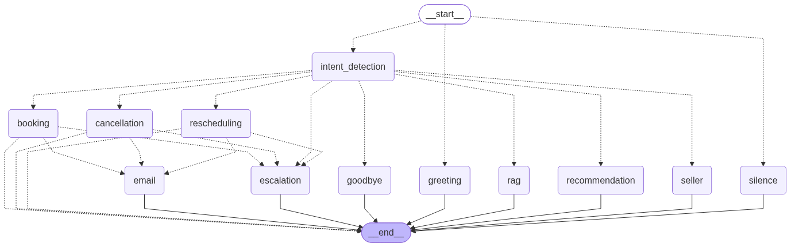

# Week 7 - Day 5: LangGraph Orchestration & Tool Calling

## Overview
Day 5 rebuilds the call-handling logic from Day 4 into a proper LangGraph agent: an explicit state schema, a graph of named nodes with deterministic routing, six wrapped tools, hard validation guardrails, and full node-transition logging. Nothing here is mocked either - the graph calls the same real Google Calendar, Gmail, and SQLite CRM store Day 4 used, plus a genuinely new Availability Checker tool Day 4 never had. Day 4's n8n workflow and FastAPI endpoints are untouched and still work; Day 5 is a separate, LangGraph-driven path built by copying Day 4's proven modules into this folder and adding an orchestration layer on top.

Routing between nodes stays deterministic (Day 4's keyword-based intent classifiers), never LLM-chosen - this preserves Day 4's "the LLM never gets to invent a booking confirmation" rule, which is what makes Task 4's guardrails structurally enforceable rather than merely prompted-for. The one place the graph does real LLM tool-calling is the RAG node, where the model chooses between semantic search and an exact structured lookup for factual questions - both are read-only, so it's safe to leave to the model.

---

## Objectives
- Design an explicit `AgentState` covering conversation history, user profile, property preferences, intent, tool outputs, and appointment status
- Design a graph that routes between Greeting, Intent Detection, RAG, Recommendation, Booking, Rescheduling, Cancellation, Email, and Goodbye
- Wrap six tool categories (Search Property, Calendar, Email, CRM, Availability Checker, RAG Search) as LangChain tools
- Enforce hard guardrails: never book an unavailable slot, never recommend an unavailable property, ask for clarification instead of guessing
- Log every node transition with an annotated execution trace
- Add a GEMINI_API_KEY fallback so a primary-model outage doesn't take the whole agent down

---

## Input
- Customer transcript text (same shape STT would produce)
- Google Calendar and Gmail OAuth credentials (the same `credentials.json`/token files Day 4 uses, found via the shared root `.env`)
- `db/knowledge_base.db` - Day 5's own copy of the SQLite file, extended with a new `graph_traces` table
- `GEMINI_API_KEY` in `.env`, for the LLM fallback

---

## How to Run

```bash
cd Day5/src
python graph.py                      # smoke test: greeting + one recommendation turn, saves graph_diagram.png
python test_langgraph_workflow.py    # full test suite (real Calendar/Gmail side effects)
SKIP_LIVE_CALENDAR=1 python test_langgraph_workflow.py   # skip the Calendar/Gmail-touching sections
```

Calling the graph directly from Python:
```python
from graph import run_turn
reply, trace = run_turn("session-123", "Mera budget 3 crore hai, DHA Phase 6 mein ghar chahiye.")
```

---

## Tasks / Features

### Task 1: State Design
`state.py` defines `AgentState` (a TypedDict) plus `SessionStore`, an in-memory `session_id -> state` map mirroring Day 4's `api.py` session pattern. Slot-filling (name/phone/budget/area/etc.) reuses `conversation_memory.py`'s parsers as-is via `slots_from_text()` rather than re-implementing that extraction logic.

### Task 2: Graph Design
`graph.py` assembles the `StateGraph` from `nodes.py`'s nine nodes. Every routing decision is a deterministic conditional edge: `intent_detection` classifies the turn and routes to booking/rescheduling/cancellation/rag/recommendation/goodbye; the three write-action nodes route through a shared `email` node only on real success, otherwise straight to `END`.



### Task 3: Tool Integration
`tools.py` wraps six tool categories as `@tool` functions, each a thin wrapper over an already-proven Day 4 function - no business logic reimplemented:
- **Search Property** - `search_property_tool`, wraps `recommendation_engine.recommend_properties`
- **Availability Checker** - `check_availability_tool`, wraps a genuinely new `calendar_integration.check_availability()` (Google Calendar `freebusy.query`) - Day 4 never checked this before booking
- **Calendar** - `book_calendar_tool` / `reschedule_calendar_tool` / `cancel_calendar_tool`
- **Email** - `email_tool`
- **CRM** - `crm_log_tool`
- **RAG Search** - `rag_search_tool` (plus `property_lookup_tool` for exact structured facts) - the one pair of tools an LLM actually chooses between, inside `rag_node`

### Task 4: Validation
Guardrails live inside `booking_node` and `rescheduling_node`, checked in this order: required slots (name/phone/property/date) must all be present, or the agent asks instead of guessing; `check_availability_tool` must confirm the slot is free, or the agent asks for a different time; only then does the calendar tool actually run. `search_property_tool` never returns an unavailable property, since `structured_retrieval.search_properties()` filters on `status="available"` by default. All verified in `test_langgraph_workflow.py` against a real conflicting Calendar event and real unavailable properties in the dataset.

### Task 5: State Logging
`graph_logger.py` was built first, before any node existed, and every node is wrapped with its `@traced_node` decorator from the moment it's defined. Each node transition prints a live enter/exit line to the terminal and writes an annotated row (node name, duration, input/output state snapshot, a short human-readable annotation) to a new `graph_traces` SQLite table. `get_execution_trace(session_id, turn_id)` returns the full annotated trace for a turn.

### Task 6: Unified Live Voice Agent
`live_voice_pipeline.py` is the single mic-to-speaker entry point, driving the same LangGraph agent used everywhere else in this project. It does NOT pick between backends - it always calls `graph.run_turn()`, full stop:

```
User speaks -> Microphone -> Deepgram Live STT (streaming) -> LangGraph unified agent
  -> Tools (RAG, Calendar, Email, Memory, CRM) -> Fish Audio TTS -> Play audio -> wait for user to speak again
```

Everything from Days 1-5 now runs through one brain (`graph.py`'s compiled `StateGraph`):
- **Day 1** - persona + full system prompt (scope, instruction hierarchy, guardrails, persuasion rules, appointment policy, escalation rules) is loaded once as `nodes.py`'s `BASE_PROMPT` and prepended to every LLM-calling node's prompt (`rag_node`, `recommendation_node`), instead of the narrower ad hoc prompts each node used before.
- **Day 2** - RAG (ChromaDB) and structured retrieval were already wired into `tools.py` (`rag_search_tool`, `property_lookup_tool`, `search_property_tool` -> `rag_pipeline.py` / `structured_retrieval.py` / `recommendation_engine.py`), reused as-is.
- **Day 3** - LLM calls, memory (`AgentState` + `slots_from_text()` reusing `ConversationMemory`), objection handling (`objection_handler.py`), and natural speech behaviors (`speech_behaviors.py`, applied centrally in `graph.run_turn()` for RAG/recommendation replies) all run inside the graph.
- **Day 4** - booking, rescheduling, cancellation, Calendar, email, CRM logging were already wired into `nodes.py`/`tools.py`, reused as-is. (`n8n/` is Day 4 reference material only, not used by the live agent - see the note at the bottom of this file.)
- **Day 5** - LangGraph `StateGraph`, `AgentState`, routing, tool calling, validation gates, node tracing - unchanged, now the only orchestrator.

**New this task:** an `escalation` node + routing, since Day 1's escalation rules had no graph implementation before. It fires on an explicit "talk to a human" request, or when a booking/reschedule/cancel fails for a real technical reason (not just missing info or an unavailable slot) - both cases log to CRM and tell the customer clearly a human will follow up.

**State persists across the whole live call.** `live_voice_pipeline.py` calls `graph.run_turn(session_id, transcript)` under one fixed `session_id` for every turn, and `SessionStore` keeps that session's `AgentState` (budget, city, area, bedrooms, conversation history, appointment status) alive between calls. So "Mera budget 3 crore hai" followed two turns later by "DHA mein options hain?" still has the budget - verified with an offline test (mocked LLM/tools) asserting `property_preferences.budget` survives across `run_turn()` calls.

`live_voice_pipeline.py` itself owns no conversation logic - it's I/O only:
- **mic in** - `live_audio_io.listen_for_utterance()` (Deepgram Live websocket + `Microphone` helper)
- **speaker out** - `live_audio_io.play_audio_bytes()` (Fish Audio TTS via `voice_pipeline.py`, played through `pygame.mixer`)

Mic is closed while the agent is speaking and reopened right after, so there's no self-hearing/echo loop - matches "wait for user to speak again" literally, at the cost of not supporting mid-reply interruption (barge-in, a known trade-off, not implemented yet).

`conversation_agent.py`'s own `run_live_mic_conversation()` is legacy - kept only because `test_live_pipeline_integration.py` still regression-tests the pre-LangGraph wiring against it, not called from `live_voice_pipeline.py`, and not a second live backend.

**`test_live_pipeline_integration.py`** - proves the wiring works without real audio hardware, Deepgram, Fish Audio, an LLM gateway, or Google Calendar/Gmail: mocks exactly those external boundaries and runs everything else for real. Covers both the legacy `conversation_agent` loop (regression only) and `live_voice_pipeline.run_live_session()` (the actual production path): every transcript reaches `graph.run_turn()` under the same `session_id`, every non-empty reply gets synthesized and played, and the loop stops on goodbye or an empty reply.

Run it: `python test_live_pipeline_integration.py`

Install/run:
```bash
pip install pygame
python live_voice_pipeline.py                 # live mic conversation loop
python live_voice_pipeline.py --session my-id  # use a specific session id
python test_live_pipeline_integration.py       # verify the integration
```
Needs PortAudio installed at the OS level for the mic capture (PyAudio's dependency):
```bash
# macOS
brew install portaudio
# Ubuntu/Debian
sudo apt-get install portaudio19-dev
# Windows - PyAudio ships pre-built, nothing extra needed
```

### Bonus: GEMINI_API_KEY Fallback
`llm_client.py` tries the primary "smart" model first; on any exception, falls back to Gemini (`gemini-flash-latest`) via the `google-genai` SDK. Used by both plain generation (`generate_reply`, the recommendation node's phrasing) and the tool-calling loop (`generate_with_tools`, the RAG node).

---

## Technologies Used
- Python
- LangGraph / LangChain (`langchain_core.tools`)
- SQLite
- Google Calendar API (OAuth), including a new `freebusy.query` availability check
- Gmail API (OAuth)
- OpenAI-compatible "smart" model, with a Gemini (`google-genai`) fallback
- ChromaDB (via Day 4's `rag_pipeline.py`)

---

## Project Structure
```
Day5/
├── db/
│   └── knowledge_base.db          # includes the graph_traces table
├── n8n/                            # copied from Day 4 for reference, not part of the live agent (see note below)
├── config/
├── persona/
├── prompts/
├── graph_diagram.png                # Task 2: rendered graph structure
├── HANDOFF.md                       # session handoff / continuity notes
└── src/
    ├── graph_logger.py              # Task 5: state logging, built first
    ├── state.py                     # Task 1: AgentState + SessionStore
    ├── llm_client.py                 # GEMINI_API_KEY fallback
    ├── tools.py                      # Task 3: 6 wrapped tools (Day 2/4's real implementations)
    ├── nodes.py                      # Task 2 nodes + Task 4 validation + Day 1 BASE_PROMPT + escalation_node
    ├── graph.py                      # THE orchestrator: StateGraph assembly, routing incl. escalation, run_turn()
    ├── calendar_integration.py       # Day 4 copy + check_availability()
    ├── test_langgraph_workflow.py    # end-to-end test (29 checks)
    ├── live_audio_io.py              # I/O only: Deepgram Live STT + pygame playback (mic/speaker)
    ├── live_voice_pipeline.py        # Task 6: the ONE live entry point - I/O (live_audio_io) + graph.run_turn(), no backend choice
    ├── test_live_pipeline_integration.py  # verifies the live-loop wiring (mocked externals)
    ├── api.py                        # Day 4, unchanged
    ├── conversation_agent.py         # Day 3/4, legacy - not used by live_voice_pipeline.py, kept for its own regression test
    ├── conversation_memory.py        # Day 3, reused by state.py's slots_from_text()
    ├── appointment_management.py     # Day 4, unchanged
    ├── appointment_intent.py         # Day 4, reused by nodes.py
    ├── email_automation.py           # Day 4, reused by tools.py
    ├── crm_logger.py                 # Day 4, reused by tools.py
    ├── call_intent.py                # Day 4, reused by nodes.py
    ├── objection_handler.py          # Day 3, reused by nodes.py
    ├── recommendation_engine.py      # Day 2, reused by tools.py
    ├── structured_retrieval.py       # Day 2, reused by tools.py/nodes.py
    ├── rag_pipeline.py               # Day 2 (ChromaDB), reused by tools.py
    ├── speech_behaviors.py           # Day 3, reused by graph.py's run_turn()
    ├── voice_pipeline.py             # Day 3, file-based STT/TTS helpers, reused by live_audio_io.py
    ├── demo_appointment_pipeline.py  # Day 4, unchanged
    ├── test_appointment_workflow.py  # Day 4, unchanged
    └── test_crm_logging.py           # Day 4, unchanged
```

Note on n8n: `n8n/` is copied over for reference but isn't part of the live agent - per the capstone spec, LangGraph replaces n8n's orchestration role from Day 5 onward (Day 7's production deployment list is "FastAPI backend, Voice services, LangGraph, Vector DB, Database, Monitoring" - n8n isn't on it).


---

## What I Learned
- How to keep an LLM-driven system's dangerous actions (booking/cancelling real appointments) safe by making graph *routing* deterministic and reserving actual LLM tool-choice for read-only operations only
- Google Calendar's `freebusy.query` needs timezone-aware RFC3339 timestamps, unlike `events().insert()` which accepts a naive datetime paired with a separate `timeZone` field - an easy 400 to trip over
- Why a provider's model catalog listing a model (e.g. `gemini-2.5-flash`) doesn't guarantee it's actually callable for a given API key/tier - `-latest`-style aliases exist specifically to dodge this
- LangGraph's node convention (return a partial state update, not the full state) has real implications for a logging wrapper - snapshotting has to merge the update into state itself before it means anything
- How to design a test suite around real external side effects instead of mocks: create a real conflicting Calendar event to prove a guardrail actually rejects it, then clean it up afterward

---

## Skills Demonstrated
- LangGraph state machine design (TypedDict state, conditional edges, node wrapping)
- LangChain tool wrapping (`@tool`, `convert_to_openai_tool`) and a manual multi-round tool-calling loop
- Multi-provider LLM fallback design
- Google Calendar `freebusy` API integration
- Structured logging/observability design (annotated execution traces)
- Guardrail design for agentic systems (deterministic routing + fail-closed validation)
- Test-driven verification without mocking external APIs

---

## Future Improvements
- Mid-reply interruption (barge-in) - right now the mic stays closed while the agent is speaking, so the caller can't cut the agent off mid-sentence the way a real phone call allows
- A Streamlit UI for the conversation back-and-forth and the `graph_traces` log
- Move `SessionStore` off an in-memory dict for multi-instance deployment (same limitation Day 4's `_sessions` dict had)
- Extend the Gemini fallback's tool-calling path to actually support tools (currently answer-only if the primary model goes down mid-tool-call)

---

## Author
Imama Zubair
AI & Data Science Intern, Netixsol
