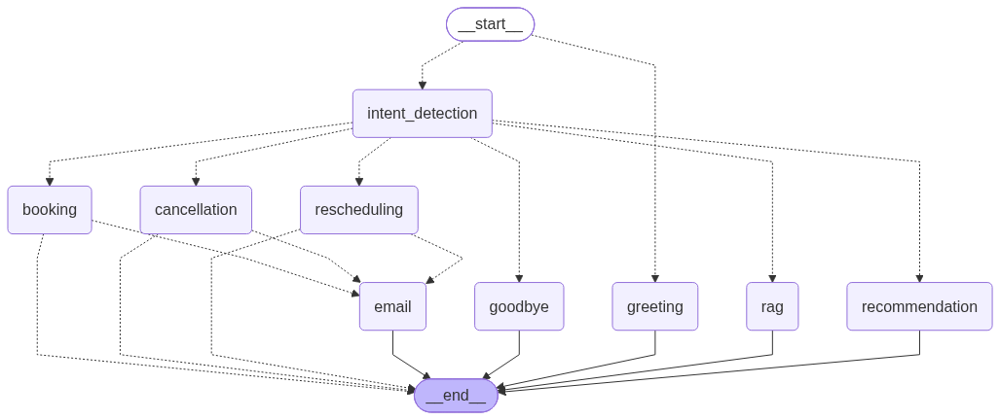

# Week 7 - Day 5: LangGraph Orchestration & Tool Calling

## Overview
Day 5 rebuilds the call-handling logic from Day 4 into a proper LangGraph agent: an explicit state schema, a graph of named nodes with deterministic routing, six wrapped tools, hard validation guardrails, and full node-transition logging. Nothing here is mocked either - the graph calls the same real Google Calendar, Gmail, and SQLite CRM store Day 4 used, plus a genuinely new Availability Checker tool Day 4 never had.

Routing between nodes stays deterministic (Day 4's keyword-based intent classifiers), never LLM-chosen - this preserves Day 4's "the LLM never gets to invent a booking confirmation" rule, which is what makes Task 4's guardrails structurally enforceable rather than merely prompted-for. The one place the graph does real LLM tool-calling is the RAG node, where the model chooses between semantic search and an exact structured lookup for factual questions - both are read-only, so it's safe to leave to the model.

**Integration pass (post-Day-5):** the LangGraph engine now sits behind a real FastAPI backend and a live-call Streamlit UI - see [Integration: FastAPI Backend + Live-Call UI](#integration-fastapi-backend--live-call-ui) below for the current architecture, how to run it, and what changed. Everything above this note describes Day 5's original LangGraph build; everything in that section describes how it's actually wired up and shipped now.

---

## Objectives
- Design an explicit `AgentState` covering conversation history, user profile, property preferences, intent, tool outputs, and appointment status
- Design a graph that routes between Greeting, Intent Detection, RAG, Recommendation, Booking, Rescheduling, Cancellation, Email, and Goodbye
- Wrap six tool categories (Search Property, Calendar, Email, CRM, Availability Checker, RAG Search) as LangChain tools
- Enforce hard guardrails: never book an unavailable slot, never recommend an unavailable property, ask for clarification instead of guessing
- Log every node transition with an annotated execution trace
- Add a GEMINI_API_KEY fallback so a primary-model outage doesn't take the whole agent down

---

## Input
- Live microphone audio (via `app.py`) or customer transcript text (same shape STT would produce)
- Google Calendar and Gmail OAuth credentials (the same `credentials.json`/token files Day 4 uses, found via the shared root `.env`)
- `db/knowledge_base.db` - extended with `graph_traces` (now with token-usage columns) and `turn_metrics`
- `.env` (repo root): `GEMINI_API_KEY` for the LLM fallback, `DEEPGRAM_API_KEY`/`DEEPGRAM_LANGUAGE`, `FISH_AUDIO_API_KEY`/`FISH_VOICE_ID`/`FISH_TTS_SPEED` (optional, default 1.15), `VOICE_AGENT_API_BASE` (optional, default `http://localhost:8000` - where `app.py` finds `src/api.py`)

---

## How to Run

**The live voice agent (current, production entrypoint)** - two processes, from `Day5/`:
```bash
uvicorn src.api:app --reload --port 8000      # terminal 1: FastAPI backend
streamlit run app.py                           # terminal 2: live-call UI
```
Open the Streamlit URL it prints, click **Start** once (grants mic access - a one-time browser requirement, same as answering a call), and talk. See the integration section below for details.

**Just the LangGraph engine, no UI** (smoke tests / calling it directly):
```bash
cd Day5/src
python graph.py                      # smoke test: greeting + one recommendation turn, saves graph_diagram.png
```

```bash
cd Day5/tests
python test_langgraph_workflow.py    # full test suite (real Calendar/Gmail side effects)
SKIP_LIVE_CALENDAR=1 python test_langgraph_workflow.py   # skip the Calendar/Gmail-touching sections
python test_appointment_workflow.py  # book -> reschedule -> cancel lifecycle, through src/api.py
```

Calling the graph directly from Python:
```python
from graph import run_turn
reply, trace = run_turn("session-123", "Mera budget 3 crore hai, DHA Phase 6 mein ghar chahiye.")
```

---

## Tasks / Features

### Task 1: State Design
`state.py` defines `AgentState` (a TypedDict) plus `SessionStore`, an in-memory `session_id -> state` map mirroring Day 4's `api.py` session pattern. Slot-filling (name/phone/budget/area/etc.) reuses `conversation_memory.py`'s parsers as-is via `slots_from_text()` rather than re-implementing that extraction logic.

### Task 2: Graph Design
`graph.py` assembles the `StateGraph` from `nodes.py`'s nine nodes. Every routing decision is a deterministic conditional edge: `intent_detection` classifies the turn and routes to booking/rescheduling/cancellation/rag/recommendation/goodbye; the three write-action nodes route through a shared `email` node only on real success, otherwise straight to `END`.



### Task 3: Tool Integration
`tools.py` wraps six tool categories as `@tool` functions, each a thin wrapper over an already-proven Day 4 function - no business logic reimplemented:
- **Search Property** - `search_property_tool`, wraps `recommendation_engine.recommend_properties`
- **Availability Checker** - `check_availability_tool`, wraps a genuinely new `calendar_integration.check_availability()` (Google Calendar `freebusy.query`) - Day 4 never checked this before booking
- **Calendar** - `book_calendar_tool` / `reschedule_calendar_tool` / `cancel_calendar_tool`
- **Email** - `email_tool`
- **CRM** - `crm_log_tool`
- **RAG Search** - `rag_search_tool` (plus `property_lookup_tool` for exact structured facts) - the one pair of tools an LLM actually chooses between, inside `rag_node`

### Task 4: Validation
Guardrails live inside `booking_node` and `rescheduling_node`, checked in this order: required slots (name/phone/property/date) must all be present, or the agent asks instead of guessing; `check_availability_tool` must confirm the slot is free, or the agent asks for a different time; only then does the calendar tool actually run. `search_property_tool` never returns an unavailable property, since `structured_retrieval.search_properties()` filters on `status="available"` by default. All verified in `test_langgraph_workflow.py` against a real conflicting Calendar event and real unavailable properties in the dataset.

### Task 5: State Logging
`graph_logger.py` was built first, before any node existed, and every node is wrapped with its `@traced_node` decorator from the moment it's defined. Each node transition prints a live enter/exit line to the terminal and writes an annotated row (node name, duration, input/output state snapshot, a short human-readable annotation) to a new `graph_traces` SQLite table. `get_execution_trace(session_id, turn_id)` returns the full annotated trace for a turn.

### Bonus: GEMINI_API_KEY Fallback
`llm_client.py` tries the primary "smart" model first; on any exception, falls back to Gemini (`gemini-flash-latest`) via the `google-genai` SDK. Used by both plain generation (`generate_reply`, the recommendation node's phrasing) and the tool-calling loop (`generate_with_tools`, the RAG node).

---

## Technologies Used
- Python
- LangGraph / LangChain (`langchain_core.tools`)
- FastAPI (backend) + Streamlit (`streamlit-webrtc` for live mic capture)
- SQLite
- Deepgram (STT, batch/prerecorded) and Fish Audio (TTS)
- Google Calendar API (OAuth), including a `freebusy.query` availability check
- Gmail API (OAuth)
- OpenAI-compatible "smart" model, with a Gemini (`google-genai`) fallback
- ChromaDB (via `rag_pipeline.py`)

---

## Project Structure
```
Day5/
├── app.py                            # Streamlit live-call UI (thin HTTP client of src/api.py)
├── db/
│   └── knowledge_base.db             # graph_traces, turn_metrics, call_transcripts, etc.
├── old_agent/                        # superseded Day 4 stack, kept for reference - see note below
├── tests/                            # standalone regression scripts (moved out of src/)
│   ├── test_langgraph_workflow.py
│   ├── test_appointment_workflow.py
│   └── test_crm_logging.py
├── config/
├── persona/
├── prompts/
├── graph_diagram.png                 # Task 2: rendered graph structure
├── HANDOFF.md                        # session handoff / continuity notes
└── src/
    ├── api.py                        # FastAPI backend - the real entrypoint, owns every provider call
    ├── audio_io.py                   # STT (Deepgram batch) + TTS (Fish Audio, tuned) - backend-only
    ├── graph_logger.py               # Task 5: state logging + token usage + turn_metrics
    ├── state.py                      # Task 1: AgentState + SessionStore
    ├── llm_client.py                 # GEMINI_API_KEY fallback + token usage accounting
    ├── tools.py                      # Task 3: 6 wrapped tools
    ├── nodes.py                      # Task 2 nodes + Task 4 validation gates
    ├── graph.py                      # Task 2: StateGraph assembly, run_turn()
    ├── calendar_integration.py       # Day 4 copy + check_availability()
    ├── conversation_memory.py        # slot-filling + phone number confirmation state machine
    ├── appointment_management.py
    ├── appointment_intent.py         # date/time parsing (proximity-matched, see below)
    ├── email_automation.py
    ├── crm_logger.py
    ├── call_intent.py
    ├── objection_handler.py
    ├── recommendation_engine.py
    ├── structured_retrieval.py
    └── rag_pipeline.py
```

Note on `old_agent/`: `conversation_agent.py`, the original `api.py` (n8n/FastAPI, conversation_memory-driven), `demo_appointment_pipeline.py`, `voice_pipeline.py`, `live_voice_pipeline.py`, and `n8n/` all lived in `src/` before this integration pass - they're the Day 4 orchestration stack that duplicated what `graph.py`/`nodes.py` now does properly, plus the live-mic CLI script that's been replaced by `app.py`. Kept for reference/grading, not part of the running system - their imports aren't maintained past the move.

---

## Integration: FastAPI Backend + Live-Call UI

This is the pass that took Day 1-5's pieces from "each works in isolation" to "actually wired together and callable as one product," fixing several concrete bugs found while testing the live agent (duplicate greeting, a date/time mis-parse, no phone number confirmation, no token/latency visibility) and adding the capstone's two remaining required pieces: a documented FastAPI backend and a demo UI.

### Architecture
`src/api.py` (FastAPI) owns every provider call - LLM (`llm_client.py`), STT/TTS (`audio_io.py`), Calendar/Gmail/CRM (the modules `nodes.py` already called) - and sits in front of the LangGraph engine (`state.py` → `graph.py` → `nodes.py` → `tools.py` → `graph_logger.py`). `app.py` (Streamlit) is a thin HTTP client of that backend: no LangGraph/Deepgram/Fish Audio imports in the UI at all, just `requests` calls.

### Bugs fixed in the LangGraph engine
- **Duplicate greeting**: `graph.py`'s entry router used to key off "is `customer_text` empty" alone, with nothing tracking "already greeted this session" - any repeated empty-text call replayed the opening line. `AgentState` now has a `greeted` flag.
- **Wrong appointment time from a multi-time sentence** (e.g. "tomorrow 12pm" resolving to a different time): `parse_appointment_datetime()` used to grab the *first* marked clock time anywhere in the sentence with no awareness of which day it actually belonged to. It now shares `parse_reschedule_datetime()`'s proximity-matching resolver and prefers the day-anchored mention over a stray one - see `appointment_intent.py`'s `_resolve_datetime_mentions()`.
- **Phone numbers dictated digit-by-digit** ("zero three double zero...") weren't understood at all, and a captured number was never read back for confirmation. `conversation_memory.py` now normalizes spoken digit words, and a fresh number always goes through a "Maine {number} liya hai, sahi hai?" confirmation turn before it's usable for booking - see `ConversationSlots.client_phone_pending`/`client_phone_confirmed`.
- **A phone-confirmation reply losing the date already given the turn before**: fixed via `nodes.py`'s `_resolve_turn_datetime()`, which remembers a confidently-parsed date/time across turns the same way name/phone/budget already accumulate.
- **A plain "yes"/name/etc. answering the agent's own clarifying question got silently misrouted** to `recommendation` instead of continuing the booking flow (no explicit book/reschedule/cancel keyword in a one-word reply). `graph.py`'s `_route_after_intent()` now stays in the same write-action node while one is genuinely still unresolved.
- **Cross-session reschedule/cancel**: a customer calling back in a new session to reschedule/cancel now falls back to `crm_logger.get_appointment_history(phone)` if this session's own state doesn't have it.

### Token usage + latency
`llm_client.py` records prompt/completion/total tokens from every LLM response (primary + Gemini fallback); `graph_logger.py`'s `traced_node` attributes them per node into `graph_traces`, and a new `turn_metrics` table (written by `src/api.py`'s `/turn/audio` endpoint) tracks STT/TTS/total latency per turn. Query them via `GET /session/{id}/trace` and `GET /session/{id}/metrics` (see `/docs`).

### TTS tuning
`audio_io.py`'s Fish Audio call adds `prosody.speed` (env var `FISH_TTS_SPEED`, default 1.15), `latency: "balanced"`, and a lower `temperature` - all verified against Fish Audio's actual `/v1/tts` schema, addressing the "speaks a little slow" complaint with real API fields instead of guesswork. The `[emotion]` bracket-tag syntax already in use was verified correct for the S2.1-Pro model, so it's unchanged.

### The live-call UI
`app.py` doesn't use push-to-talk - it uses `streamlit-webrtc` to keep the mic live for the whole call (one click on **Start** to grant mic access, unavoidable browser requirement, same gesture as answering a phone) and a simple energy-based VAD (`pydub` RMS per audio frame) to segment speech into turns automatically as you talk. Each segmented utterance goes to `POST /session/{id}/turn/audio`, the reply plays back automatically, and listening resumes - no button per turn. The call opens with the agent's greeting spoken automatically (`/session/start` now synthesizes it, not just returns text).

### Verification
Backend logic verified via `fastapi.testclient.TestClient` (no browser needed) for every endpoint, including a full book → reschedule → cancel lifecycle through real multi-turn conversation (`tests/test_appointment_workflow.py`). The UI itself was verified in an actual headless-Chromium browser via Playwright - including feeding Chromium a real speech recording as a fake microphone input (`--use-file-for-fake-audio-capture`) to prove the WebRTC capture → VAD segmentation → STT → LangGraph turn → TTS → autoplay → resume-listening loop genuinely completes multiple turns hands-free, not just that the page renders.

---

## What I Learned
- How to keep an LLM-driven system's dangerous actions (booking/cancelling real appointments) safe by making graph *routing* deterministic and reserving actual LLM tool-choice for read-only operations only
- Google Calendar's `freebusy.query` needs timezone-aware RFC3339 timestamps, unlike `events().insert()` which accepts a naive datetime paired with a separate `timeZone` field - an easy 400 to trip over
- Why a provider's model catalog listing a model (e.g. `gemini-2.5-flash`) doesn't guarantee it's actually callable for a given API key/tier - `-latest`-style aliases exist specifically to dodge this
- LangGraph's node convention (return a partial state update, not the full state) has real implications for a logging wrapper - snapshotting has to merge the update into state itself before it means anything
- How to design a test suite around real external side effects instead of mocks: create a real conflicting Calendar event to prove a guardrail actually rejects it, then clean it up afterward

---

## Skills Demonstrated
- LangGraph state machine design (TypedDict state, conditional edges, node wrapping)
- LangChain tool wrapping (`@tool`, `convert_to_openai_tool`) and a manual multi-round tool-calling loop
- Multi-provider LLM fallback design
- Google Calendar `freebusy` API integration
- Structured logging/observability design (annotated execution traces)
- Guardrail design for agentic systems (deterministic routing + fail-closed validation)
- Test-driven verification without mocking external APIs

---

## Future Improvements
- A real telephony layer (Twilio Media Streams or similar) in front of `src/api.py` - deliberately out of scope for this pass, the architecture (a backend that owns provider calls, callable over HTTP) is set up so this can plug in without touching the LangGraph engine
- Move `SessionStore` off an in-memory dict for multi-instance deployment (same limitation Day 4's `_sessions` dict had)
- Extend the Gemini fallback's tool-calling path to actually support tools (currently answer-only if the primary model goes down mid-tool-call)
- Tune the live-call VAD's silence threshold/duration per real microphone/room noise rather than the current fixed defaults
- Day 6/7 work (evaluation suite, prompt-injection testing, monitoring, Docker deployment) - explicitly out of scope for this integration pass

---

## Author
Imama Zubair
AI & Data Science Intern, Netixsol
